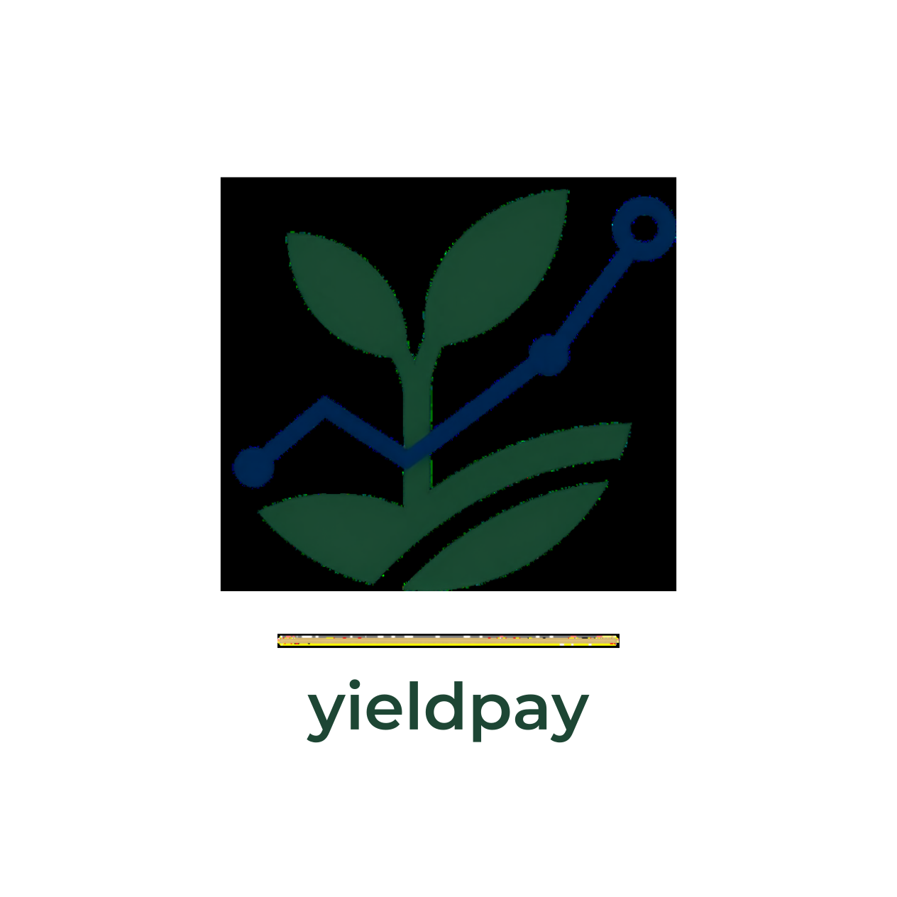

<div align="center">
  
  <h1>YieldPay AI</h1>
  <p><strong>Fund a Farmer. Share the Yield.</strong></p>
  <p><em>An intensive agricultural fintech platform built for the Moolre Startup Cup.</em></p>
</div>

---

## 🌾 The Vision

**YieldPay AI** solves a critical structural problem in West African agriculture: smallholder farmers lack the pre-harvest working capital required to maximize their crop yields, while urban populations have disposable income but no direct, trustworthy mechanism to invest in the agricultural supply chain.

YieldPay bridges this gap by turning urban food demand into direct pre-harvest financing. We provide an end-to-end ecosystem that connects farmers without internet access (via USSD) to urban buyers (via an elegant Web Platform), fully powered by **Moolre's robust Fintech APIs**.

---

## 🚀 Intensive Core Features

### 1. Offline Farmer Onboarding (Moolre USSD)
Farmers in rural areas do not need smartphones or internet to participate. They simply dial the Moolre-provided USSD code (`*919*4018#`) on any basic feature phone. 
- **Registration**: Farmers register their identity and mobile money number.
- **Crop Listing**: Farmers can list an upcoming harvest (e.g., Maize, 10 Acres, GHS 5000 required).
- **Updates**: Farmers report progress (planting, growing, harvesting) via USSD menus.

### 2. Urban Capital Injection (Moolre Collections)
Urban buyers browse the YieldPay Web Marketplace to discover active, vetted farms. 
- When a buyer decides to fund a farm, the platform initiates a seamless **Moolre Collection** request.
- The funds are securely aggregated until the farm's required capital target is met.

### 3. Automated Capital Deployment (Moolre Disbursements)
Once a farm is fully funded, YieldPay automatically triggers a **Moolre Disbursement**.
- The working capital is instantly sent directly to the farmer's registered mobile money wallet.
- This ensures zero intermediaries, zero delays, and complete financial transparency.

### 4. Real-time Notifications (Moolre SMS)
Trust is built on communication. YieldPay utilizes **Moolre SMS** to keep all parties instantly informed.
- **Farmers** receive SMS alerts when their farm receives partial funding or when funds are disbursed.
- **Buyers** receive SMS updates regarding the lifecycle progress of the farm they invested in.

### 5. AI-Powered Crop Risk Insurance (Google Gemini AI)
Agriculture is inherently risky. YieldPay mitigates this with an automated AI insurance underwriter.
- If a farmer faces an issue (e.g., pest infestation, drought), they report the incident via USSD.
- **Google Gemini AI** parses the unstructured incident report, structures it, and calculates an initial claim severity and payout recommendation.

---

## 🏗️ Technical Architecture

YieldPay is a modern, full-stack Next.js application designed for scale, speed, and aesthetic excellence.

- **Frontend**: Next.js 14 App Router, React, Tailwind CSS (Custom Moolre color tokens, Glassmorphism, Premium Typography with Outfit & Fraunces fonts).
- **Backend**: Next.js Serverless API Routes.
- **Database**: MongoDB Atlas (via Mongoose ODM) with robust schemas for `User`, `Farmer`, `CropCycle`, `Transaction`, and `InsuranceClaim`.
- **Integrations**: 
  - `api.moolre.com` (Collections, Disbursements, SMS).
  - Webhooks (`/api/webhooks/moolre`) to asynchronously handle transaction status updates.
  - USSD Gateway (`/api/ussd`) to handle incoming state-based USSD sessions.

---

## 🏆 Moolre Startup Cup Alignment

YieldPay is explicitly engineered to excel in the Moolre Startup Cup judging categories:

1. **Best Integration**: We utilize the *entire* Moolre stack (USSD, SMS, Collections, Disbursements, and Webhooks) in a single, cohesive workflow.
2. **Best UX**: A stunning, animated, responsive UI that instills financial trust and premium aesthetics.
3. **Practical AI**: Gemini AI is not a gimmick; it actively underwrites insurance claims by parsing raw USSD text inputs into structured data.
4. **Social Impact & Zagey Vision**: Creates a direct pipeline of wealth distribution from urban centers to rural producers, empowering everyday people.

---

## ⚙️ Environment Setup

To run YieldPay locally, copy `.env.example` to `.env` and fill in the following:

```env
MONGODB_URI=your_mongodb_atlas_connection_string
NEXT_PUBLIC_APP_URL=http://localhost:3000

# Moolre API Configuration
MOOLRE_BASE_URL=https://api.moolre.com
MOOLRE_API_KEY=your_public_key
MOOLRE_SECRET=your_private_key
MOOLRE_COLLECTIONS_ENDPOINT=/v1/collections
MOOLRE_DISBURSEMENT_ENDPOINT=/v1/disbursements
MOOLRE_SMS_ENDPOINT=/v1/sms
MOOLRE_USSD_SERVICE_CODE=*919*4018#
MOOLRE_SENDER_ID=YieldPay

# AI Configuration
GEMINI_API_KEY=your_google_gemini_api_key
```

## 💻 Running the App

```bash
# 1. Install dependencies
npm install

# 2. (Optional) Seed the database with mock farmers and crops
npm run seed

# 3. Start the development server
npm run dev
```

Navigate to `http://localhost:3000` to interact with the platform.

## 📡 Webhook & USSD Configuration (Production)

When deploying to Vercel (or any production environment), configure your Moolre dashboard with the following endpoints:

- **USSD Callback URL**: `https://your-domain.com/api/ussd`
- **Payment Webhook URL**: `https://your-domain.com/api/webhooks/moolre`
